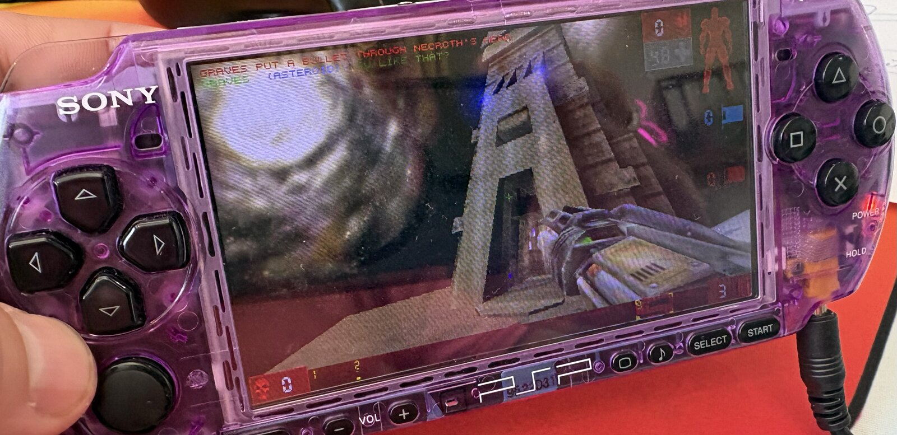

# Unreal Tournament (UT99) on the PSP



A port of the original *Unreal Tournament* (v400) to the PSP-2000 and later models: deathmatch,
capture the flag, domination and assault against bots, on the console, from a homebrew EBOOT. It is
playable and still being worked on. Matches run at 17 to 20 fps on hardware (capped at 20) with
music and sound, and a 20-minute session with bots and three map changes ran without a crash. Most
maps and game types have not had real play time yet, which is where you come in.

It is built on [maximqaxd/ut99dc](https://github.com/maximqaxd/ut99dc) (the UT v400 engine as ported
to the Dreamcast) and reuses the PSP renderer, file and audio layers of the
[Unreal (1998) PSP port](https://github.com/barttenbrinke/UE1).

## Install

You need a PSP-2000, 3000, Go or Street with custom firmware that runs homebrew (PRO, ME or ARK), a
Memory Stick with 650 MB free, and a computer to run two shell scripts on. A Mac has everything they
use out of the box. On Linux install `curl`, `rsync` and `libarchive-tools` (or `p7zip`). On Windows
use [WSL](https://learn.microsoft.com/windows/wsl/install) with Ubuntu, install the same three
packages there, and the stick shows up as `/mnt/<drive letter>/PSP/GAME`.

```
git clone https://github.com/barttenbrinke/UnrealTournamentPSP.git && cd UnrealTournamentPSP
./fetch-assets.sh                                   # downloads the UT v400 CD image from archive.org (~760 MB)
./install-psp.sh /Volumes/<your stick>/PSP/GAME     # copies the EBOOT, the game data and the settings
```

`fetch-assets.sh` uses `aria2c` when it is installed (much faster on archive.org). The port needs the
original **v400** data: later patches (GOTY, 436, 469) are not compatible with this engine. If you
own the CD, copy its `System`, `Maps`, `Textures`, `Sounds` and `Music` folders into `GAME_ASSETS/`
instead of running the fetch script. `EBOOT.PBP` in the repository is the current build. Run
`install-psp.sh` again after updating: it also patches a few of the game's text files (the prompts
that name keyboard keys).

The PSP-1000 is not supported: its 32 MB of RAM are not enough. For PPSSPP, install to
`~/.config/ppsspp/PSP/GAME` (the installer moves the music off the Media Engine, which PPSSPP does
not emulate). A file `System/cmdline.txt` with a map URL, for example
`CTF-Face?Game=Botpack.CTFGame`, starts straight into that map.

## Play

Launch **Unreal Tournament** from the Game menu of the XMB. Start-up takes about 30 seconds from the
Memory Stick, and a map about 5 to 10. Press Start for the menu. **Game > Start Practice Session**
is the quickest way into a match: pick the game type, the map and the bots, and press Start. The
tournament ladder (**Start Unreal Tournament**) works too; its screens are made for 640x480, and the
small red arrows at the bottom are Back and Next.

**Saving does not work.** Tournament ladder progress is not kept between sessions, so **Resume Saved
Tournament** has nothing to resume. Practice sessions and single matches are not affected.

There is no online or LAN play: the PSP build has no network, and the Multiplayer menu starts
matches offline.

### Controls

| Button | In game | In the menus |
|---|---|---|
| Analog stick | look / aim | move the cursor |
| Triangle / Cross | move forward / back | Enter / click |
| Square / Circle | strafe left / right | right click / back |
| L | fire | |
| R | alt-fire (hold to charge) | |
| R + tap L | jump | |
| D-pad down | crouch | move the cursor |
| D-pad left / right | previous / next weapon | move the cursor |
| D-pad up | | move the cursor |
| R + D-pad up | use selected item | |
| R + D-pad left / right | previous / next item | |
| Start | menu | close |
| Select | scores | |

Auto-aim is on (as on the Dreamcast): shots bend toward a target within about 20 degrees of
the crosshair. Turn it off with `MyAutoAim=1.0` in `System/User.ini`, or invert the vertical look
with `JoyY=Axis aLookUp speed=-0.5`. Auto-aim works offline at bot skill 2 or lower.

In deathmatch you start waiting for the match: press L (fire) to begin. Holding the stick fully
left or right speeds the turn up after a moment, for turning round on the spot.

## I want to help debug

What needs playing most:

* **Every stock map.** There are 25 deathmatch, 10 capture the flag, 11 domination and 8 assault
  maps, and only a handful have run on hardware. Start a practice session on one with a few bots and
  play a match through to the end and the next map. Note where the frame rate drops badly, where a
  map fails to load, where a sound loops or is missing, and where anything looks wrong.
* **Assault and domination.** These game types lean on triggers, objectives and scripted events that
  deathmatch never touches.
* **The tournament ladder**, as far as you get in one sitting.
* **Long sessions.** Leave a match running with bots for half an hour, through several map changes.

## I found something broken!

When something breaks (a crash, a map that will not load, a sound that loops forever, a slideshow),
[open an issue](https://github.com/barttenbrinke/UnrealTournamentPSP/issues) with:

1. What happened and where: the map, the game type, how many bots, and what you were doing. As saves
   do not work, this description is what lets the problem be replayed: the port can start any map
   with bots and scripted input while the log is watched over PSPLink.
2. `PSP/GAME/UnrealTournament/System/UnrealTournament.log` from the stick, taken right after the
   problem (the file is rewritten at every launch).
3. Your PSP model and firmware, and which EBOOT you ran (the commit you cloned, or your own build).

Performance observations without a crash are welcome too: the map and spot, and roughly what the game
did (slideshow, hitching, fine).

## Building

Install [pspdev](https://github.com/pspdev/pspdev), then `./build-psp.sh` (`--release` also copies
the EBOOT to the repository root). `tools/run-ppsspp.sh` runs a build in PPSSPP and prints the log.

## Note

Unreal Engine, Unreal Tournament and any related trademarks or copyrights are owned by Epic Games.
This repository is not affiliated with or endorsed by Epic Games, and contains no game data. Do not
use for commercial purposes.
